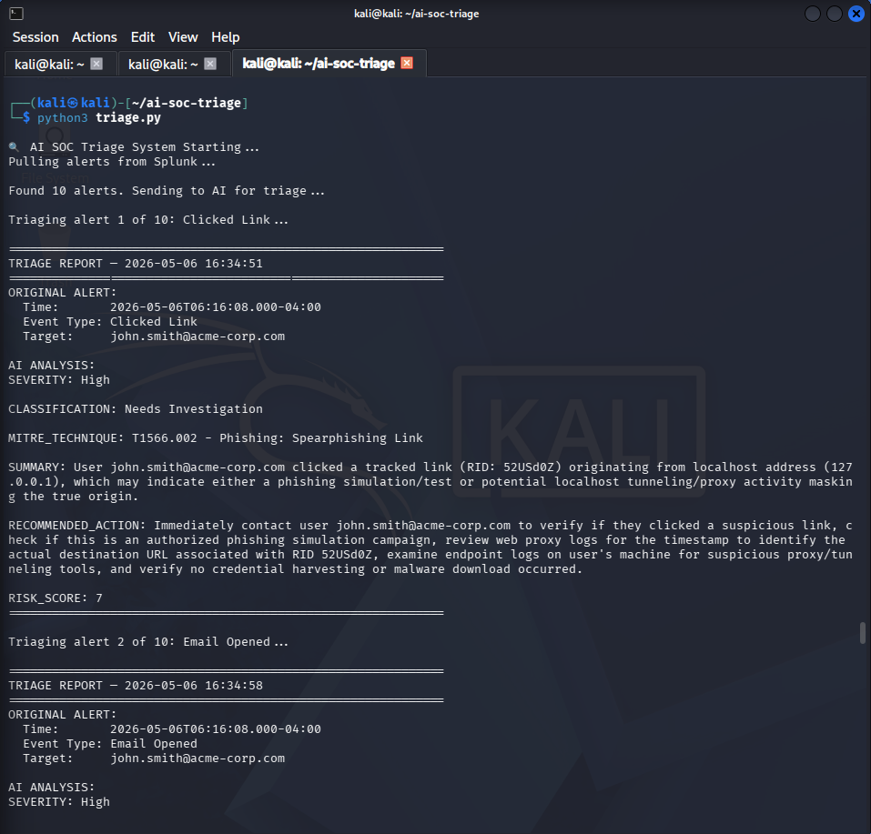
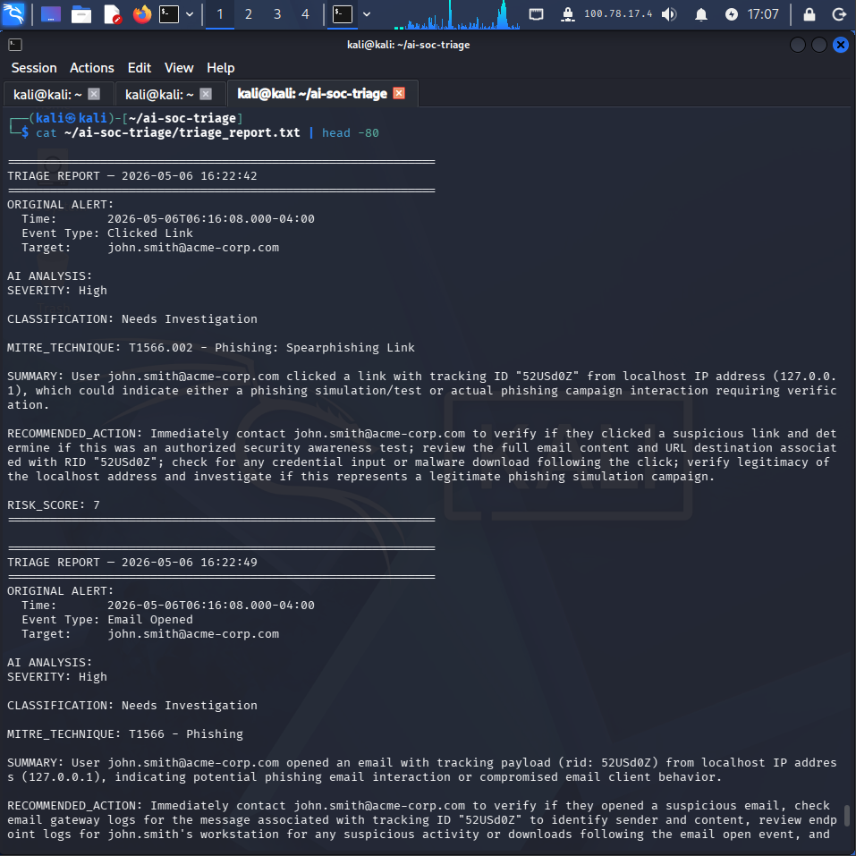
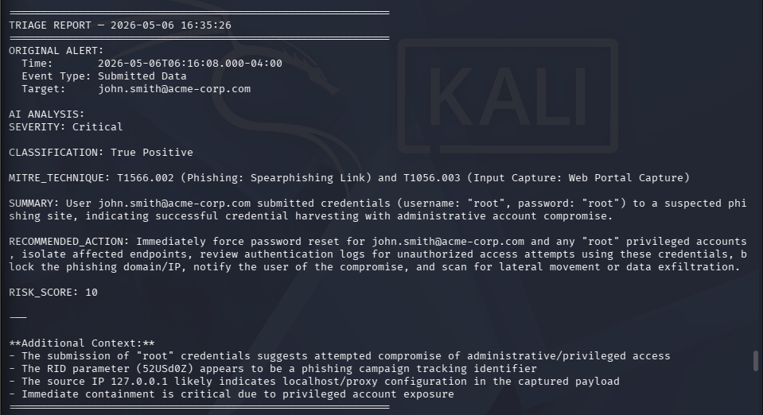

# 🛡️ AI-Powered SOC Alert Triage System

[](https://python.org)
[](https://anthropic.com)
[](https://splunk.com)
[](https://attack.mitre.org)
[](https://kali.org)
[](LICENSE)

> An AI-assisted SOC triage pipeline that automatically pulls live alerts from Splunk, sends each one to Claude for analysis, and returns structured severity ratings, MITRE ATT&CK mappings, and recommended actions — in seconds.

> **This project extends the [Phishing Detection Lab](https://github.com/cpt-ferna02/splunk-phishing-lab)** — feeding its live Splunk alerts into an AI triage engine.

---

## 🎬 The Story: From Alert Flood to AI-Driven Triage

> *This project was built to answer one question: what if a junior SOC analyst never had to do first-pass triage again?*

Every SOC analyst knows the feeling. You log in for your shift and the queue already has hundreds of alerts waiting. Most are noise, some are real, and a few are genuinely critical — but you won't know which until you've read through all of them. The average enterprise SOC receives **thousands of alerts per day**, and studies show **over 40% go uninvestigated** due to alert fatigue.

This project simulates building the solution to that problem from scratch — a full AI-assisted triage pipeline that handles the entire first-pass workflow automatically.

---

## 🗺️ Project Timeline

Here's how this project was built, step by step — and more importantly, **why** each decision was made.

---

### Phase 1 — Simulate the Attack 🎣

**The problem:** You can't build a detection system without something to detect.

The first step was generating realistic phishing attack data using **GoPhish** (an open-source phishing simulation framework) and **Mailhog** (a local SMTP server that catches all outbound emails safely in a lab environment). A full phishing campaign was configured targeting a fictional employee — `john.smith@acme-corp.com` — and launched against the local mail server.

This generated the full phishing kill chain as real event data:
- Campaign Created
- Email Sent
- Email Opened
- Link Clicked
- Credentials Submitted *(the critical one)*

**Why this matters:** Real SOC environments deal with exactly this event sequence. Simulating it end-to-end means the triage system gets trained on realistic, meaningful data — not toy examples.

---

### Phase 2 — Detect It in Splunk 📊

**The problem:** Raw GoPhish events are JSON blobs. They need to land in a SIEM to be queryable as security alerts.

A Python forwarder (`gophish_to_splunk.py`, from the [Phishing Detection Lab](https://github.com/cpt-ferna02/splunk-phishing-lab)) was used to forward every GoPhish event to **Splunk Enterprise** via the HTTP Event Collector (HEC). Each event type gets indexed with its own `source` and `sourcetype`, making it trivially searchable.

```
index=main source=gophish
| table _time, message, email, details
```

Splunk now holds the live alert queue — the same way an enterprise SIEM holds alerts from EDR, firewall, and email gateway feeds.

**Why this matters:** Splunk is the dominant enterprise SIEM. Knowing how to ingest, search, and build pipelines against it is a core SOC skill.

---

### Phase 3 — Build the AI Triage Engine 🤖

**The problem:** A human analyst triaging 10 alerts takes 20–30 minutes. Triaging 1,000 takes all day. The goal was to make it take seconds.

The core of the project is `triage.py` — a Python script that:
1. Connects to Splunk's REST API and pulls the latest alerts
2. Formats each alert into a structured prompt for Claude (Anthropic's AI)
3. Enforces a strict output schema so the AI returns machine-readable results
4. Writes every triage report to `triage_report.txt` with full timestamps

The prompt engineering was the hardest part. Getting consistent, parseable output from an LLM required several iterations:

```python
prompt = f"""
You are a SOC analyst triaging a security alert.
Analyze this phishing detection alert and provide a structured assessment.

ALERT DATA:
- Time: {event.get('_time')}
- Event Type: {event.get('message')}
- Target Email: {event.get('email')}
- Details: {event.get('details')}

Provide your analysis in this EXACT format:

SEVERITY: [Critical/High/Medium/Low]
CLASSIFICATION: [True Positive/False Positive/Needs Investigation]
MITRE_TECHNIQUE: [technique ID and name]
SUMMARY: [one sentence summary]
RECOMMENDED_ACTION: [specific SOC action]
RISK_SCORE: [1-10]
"""
```

Enforcing a strict output schema in the prompt is the same technique used in production AI security pipelines — it makes the output machine-readable and automatable, not just human-readable.

**Why this matters:** This is prompt engineering applied to a real security workflow — the same approach used by commercial AI-SIEM tools like Splunk AI and Microsoft Copilot for Security.

---

### Phase 4 — Run It and Validate the Results ✅

**The problem:** An AI triage system that can't be trusted is worse than no system at all. Every result needed validation against what a human analyst would actually do.

The system was run against 10 live Splunk alerts from the GoPhish campaign. Every AI output was reviewed against the raw alert data to verify the severity rating, MITRE mapping, and recommended action were correct.

**Screenshot 1 — The triage engine running against live Splunk alerts:**

[](screenshots/01-triage-running.png)

**Screenshot 2 — The most critical alert: credentials submitted (Risk Score 9):**

[](screenshots/02-critical-alert.png)

**Screenshot 3 — Full incident report generated for the credential submission event:**

[](screenshots/03-full-report.png)

---

## 📊 Live Run Results

Results from a live run against 10 phishing alerts:

| # | Alert Type | AI Severity | Classification | MITRE Technique | Risk Score |
|---|------------|-------------|----------------|-----------------|------------|
| 1 | Submitted Data | **Critical** | True Positive | T1566 / T1056.003 | **9/10** |
| 2 | Submitted Data | **Critical** | True Positive | T1566 / T1056.003 | **9/10** |
| 3 | Clicked Link | High | Needs Investigation | T1566.002 | 7/10 |
| 4 | Clicked Link | High | Needs Investigation | T1566.002 | 7/10 |
| 5 | Email Opened | High | Needs Investigation | T1566 | 7/10 |
| 6 | Email Opened | High | Needs Investigation | T1566 | 7/10 |
| 7 | Email Sent | Medium | Needs Investigation | T1566 | 5/10 |
| 8 | Email Sent | Low | Needs Investigation | T1566 | 3/10 |
| 9 | Campaign Created | Medium | Needs Investigation | T1566 | 5/10 |
| 10 | Campaign Created | Low | Needs Investigation | T1566 | 3/10 |

The AI correctly escalated the two credential submission events to **Critical** with True Positive classification — exactly what a human analyst should prioritize first.

---

## 🧠 Sample AI Triage Output

```
============================================================
TRIAGE REPORT — 2026-05-06 16:23:13
============================================================
ORIGINAL ALERT:
  Time:       2026-05-06T06:16:08
  Event Type: Submitted Data
  Target:     john.smith@acme-corp.com

AI ANALYSIS:
SEVERITY: Critical
CLASSIFICATION: True Positive
MITRE_TECHNIQUE: T1566 / T1056.003 - Phishing / Web Portal Capture
SUMMARY: User john.smith@acme-corp.com submitted corporate credentials
to a suspected phishing portal, indicating successful credential harvesting.
RECOMMENDED_ACTION: Immediately force password reset for
john.smith@acme-corp.com, disable affected accounts pending investigation,
audit recent authentication logs for unauthorized access, check for lateral
movement or data exfiltration, and block phishing infrastructure.
RISK_SCORE: 9
============================================================
```

---

## 🏗️ Architecture

```
┌─────────────────────────────────────────────────────┐
│                    ATTACK LAYER                      │
│  GoPhish Campaign → Mailhog → Phishing Kill Chain   │
└──────────────────────────┬──────────────────────────┘
                           │
                           ▼
┌─────────────────────────────────────────────────────┐
│                  DETECTION LAYER                     │
│       Splunk SIEM (index=main source=gophish)       │
│  Email Sent | Opened | Clicked | Submitted Data     │
└──────────────────────────┬──────────────────────────┘
                           │
                           ▼
┌─────────────────────────────────────────────────────┐
│                    TRIAGE LAYER                      │
│            Python Triage Engine (triage.py)         │
│    Pulls alerts from Splunk REST API every run      │
└──────────────────────────┬──────────────────────────┘
                           │
                           ▼
┌─────────────────────────────────────────────────────┐
│                      AI LAYER                        │
│              Anthropic Claude API                    │
│  Input:  Raw alert data                             │
│  Output: Severity | Classification | MITRE |        │
│          Summary | Recommended Action | Risk Score  │
└──────────────────────────┬──────────────────────────┘
                           │
                           ▼
┌─────────────────────────────────────────────────────┐
│                   REPORTING LAYER                    │
│    triage_report.txt — full timestamped report      │
└─────────────────────────────────────────────────────┘
```

---

## 🔍 MITRE ATT&CK Coverage

| Alert Type | Technique ID | Technique Name |
|------------|-------------|----------------|
| Submitted Data | T1566 / T1056.003 | Phishing / Web Portal Capture |
| Clicked Link | T1566.002 | Spearphishing Link |
| Email Opened | T1566 | Phishing |
| Campaign Created | T1566 | Phishing Infrastructure |

---

## 💡 What This Demonstrates

- **SIEM integration** — connecting a live Splunk instance to an external API via Python
- **AI prompt engineering** — enforcing structured output schemas for machine-readable LLM responses
- **SOC workflow automation** — replacing manual first-pass triage with an automated pipeline
- **MITRE ATT&CK mapping** — contextualizing raw alerts to known adversary techniques
- **Full kill chain coverage** — from phishing attack simulation to AI-generated incident report
- **Real-world cost modeling** — understanding the economics of AI-assisted vs. human-only triage

---

## 🛠️ Tools & Technologies

| Tool | Purpose | Cost |
|------|---------|------|
| Python 3.13 | Core scripting language | Free |
| Anthropic Claude API | AI alert analysis engine | ~$0.001/alert |
| Splunk Enterprise | SIEM — alert source | Free (500MB/day) |
| GoPhish | Phishing simulation | Free / Open Source |
| Mailhog | Local SMTP server | Free / Open Source |
| Kali Linux 2026.1 | Lab OS | Free |

---

## 💰 Cost Estimate

| Volume | Estimated Cost |
|--------|---------------|
| 10 alerts (this lab) | ~$0.01 |
| 100 alerts/day | ~$0.10/day |
| 1,000 alerts/day | ~$1.00/day |
| Enterprise scale (10k/day) | ~$10.00/day |

Compared to junior analyst headcount for the same triage volume, the ROI is significant — which is why AI-assisted triage is one of the fastest-growing areas in enterprise security.

---

## 🚀 Quick Start

### Prerequisites
- Kali Linux 2026.1
- Python 3.13+
- Splunk Enterprise 9.3.2+ running locally
- Anthropic API key ([console.anthropic.com](https://console.anthropic.com))
- [Phishing Detection Lab](https://github.com/cpt-ferna02/splunk-phishing-lab) running and generating events

### Step 1 — Clone the repo
```bash
git clone https://github.com/cpt-ferna02/ai-soc-triage.git
cd ai-soc-triage
```

### Step 2 — Install dependencies
```bash
pip3 install anthropic requests --break-system-packages
```

### Step 3 — Configure credentials
```bash
nano config.py
```
```python
# Splunk settings
SPLUNK_HOST     = "https://localhost:8089"
SPLUNK_USER     = "YOUR_SPLUNK_USERNAME"
SPLUNK_PASS     = "YOUR_SPLUNK_PASSWORD"
SPLUNK_HEC      = "http://localhost:8088/services/collector/event"
SPLUNK_HEC_TOK  = "YOUR_HEC_TOKEN"

# Anthropic API
ANTHROPIC_KEY   = "YOUR_ANTHROPIC_API_KEY"

# GoPhish settings
GOPHISH_API     = "https://localhost:3333/api"
GOPHISH_KEY     = "YOUR_GOPHISH_API_KEY"
```
> `config.py` is in `.gitignore` — your credentials will never be committed to GitHub.

### Step 4 — Start the phishing lab services
```bash
# Terminal 1 — Mailhog
cd ~ && ./MailHog_linux_amd64

# Terminal 2 — GoPhish
cd ~/gophish && sudo ./gophish

# Terminal 3 — Splunk
sudo /opt/splunk/bin/splunk start

# Terminal 4 — GoPhish to Splunk forwarder
python3 ~/lab/gophish_to_splunk.py
```

### Step 5 — Run the triage engine
```bash
python3 triage.py
```

The system will pull the 10 most recent Splunk alerts, send each to Claude, print structured triage reports, and save everything to `triage_report.txt`.

---

## 📁 Project Structure

```
ai-soc-triage/
├── triage.py              # Main AI triage engine
├── config.py              # Credentials (gitignored)
├── .gitignore
├── triage_report.txt      # Sample output report
└── screenshots/
    ├── 01-triage-running.png
    ├── 02-critical-alert.png
    ├── 03-full-report.png
    └── 04-splunk-events.png
```

---

## 🔬 Under the Hood — How & Why It Actually Works

> *This section breaks down the technical reasoning behind each component — not just what was built, but why it works, where it could break, and how it maps to real enterprise security operations.*

---

### Why Splunk's REST API Instead of a Direct Log File?

The triage engine queries Splunk via its REST API (`/services/search/jobs`) rather than reading log files directly. This is a deliberate design choice that mirrors how production SOC tools work:

- **Log files are static.** The REST API returns live, queryable data with filters, time ranges, and field extractions already applied by Splunk — no parsing needed.
- **Splunk's search language (SPL) does the heavy lifting.** By the time the alert reaches the Python script, it's already structured and filtered. The AI gets clean input, not raw log noise.
- **This is how enterprise integrations work.** SOAR platforms like Splunk SOAR, Palo Alto XSOAR, and IBM QRadar SOAR all integrate with SIEMs via REST APIs — never raw file reads.

The tradeoff: REST API calls require authentication and are rate-limited. A production version would use a service account with scoped read-only permissions on specific indexes — not admin credentials.

---

### Why the Prompt Schema Matters — And Where It Can Fail

The prompt enforces a strict output format with exact field names (`SEVERITY:`, `RISK_SCORE:`, etc.). This isn't just good practice — it's necessary for the output to be machine-parseable.

**What happens without a schema:** The LLM returns natural language like *"This looks like a high-severity phishing attempt..."* — useful for a human, but impossible to parse programmatically into a database or SOAR ticket.

**What the schema enables:** The output can be split on newlines, parsed by field name, and fed directly into downstream automation — a SOAR platform, a Slack alert, a ticketing system.

**Where it can still break:** LLMs are non-deterministic. Even with a strict schema, the model occasionally adds extra context, changes field ordering, or wraps values in brackets. A production version would add a validation layer that checks every required field is present before writing the report — and retries with a stricter prompt if not.

---

### Why the Risk Score Is Meaningful (Not Just a Number)

The AI assigns a `RISK_SCORE` from 1–10, and the scoring isn't arbitrary — it reflects real SOC prioritization logic:

| Score | Meaning | Example |
|-------|---------|---------|
| 9–10 | Critical — immediate response required | Credentials submitted to phishing portal |
| 7–8 | High — investigate within the hour | User clicked a tracked phishing link |
| 5–6 | Medium — investigate same shift | Phishing email opened, no interaction |
| 3–4 | Low — log and monitor | Phishing email sent, no opens yet |
| 1–2 | Informational | Campaign infrastructure created |

This mirrors how commercial SIEM tools like Splunk ES use **risk-based alerting (RBA)** — aggregating risk scores across events tied to the same user or asset to surface the highest-priority investigations. A single Risk Score 4 event might not warrant action; the same user accumulating a Risk Score 4 + 7 + 9 in 10 minutes absolutely does.

---

### Why T1566 and T1056.003 — Understanding the MITRE Mapping

Every alert gets mapped to a specific MITRE ATT&CK technique. This isn't cosmetic — it's operationally meaningful:

- **T1566 (Phishing)** — the parent technique. Covers any phishing attempt regardless of outcome. Applied to email sent/opened events because at that stage, a phishing attack is underway but hasn't succeeded yet.
- **T1566.002 (Spearphishing Link)** — sub-technique for link-based delivery. Applied when the user clicks the tracked URL, confirming interaction with the phishing payload.
- **T1056.003 (Web Portal Capture)** — this is the critical escalation. It maps to adversary credential harvesting via a fake login portal. When a user submits credentials, the attack has succeeded — this is no longer a potential threat, it's a confirmed compromise.

**Why this matters in practice:** MITRE technique mappings are how SOC teams write detection rules, prioritize response playbooks, and report to leadership. Knowing that a `Submitted Data` event maps to T1056.003 tells the analyst exactly which playbook to follow — force password reset, check for lateral movement, hunt for data exfiltration.

---

### Why the AI Classifies Some Alerts as "Needs Investigation" Instead of True/False Positive

The three-way classification (`True Positive / False Positive / Needs Investigation`) is intentional and reflects how real triage works:

- **True Positive** is only assigned when the evidence is unambiguous — credentials submitted means a real compromise occurred, not a simulation artifact.
- **Needs Investigation** is assigned when the alert could be either legitimate activity or an attack. A link click from `127.0.0.1` (localhost) is ambiguous — it could be a phishing simulation, a security awareness test, or a misconfigured proxy. The AI correctly flags these for human review rather than making a confident wrong call.
- **False Positive** would be assigned if the alert clearly maps to known benign activity — for example, if the email address was a honeypot account specifically set up to receive phishing tests.

**The key insight:** An AI triage system that confidently misclassifies is more dangerous than one that says "I'm not sure." The `Needs Investigation` bucket exists specifically to preserve human judgment where the data is ambiguous — this is the same logic behind confidence thresholds in ML-based detection systems.

---

### The Localhost IP Problem — And What It Reveals About the Lab

Several alerts show a source IP of `127.0.0.1` (localhost). In a real investigation, this would be a red flag — it suggests either a misconfigured proxy, a localhost tunnel, or a capture artifact. In this lab, it's expected: GoPhish and Mailhog are both running on the same Kali Linux host, so all traffic originates and terminates locally.

**Why this is worth understanding:** In a real enterprise environment, seeing `127.0.0.1` as a source in phishing telemetry would prompt immediate investigation of the email gateway and proxy configuration. It could indicate the phishing infrastructure is running inside the network, or that a MITM proxy is stripping source IP information. The AI correctly notes this ambiguity in its recommended actions — *"verify legitimacy of the localhost address"* — rather than ignoring it.

---

### Security Considerations — What This Pipeline Gets Right and What It Doesn't

**What this pipeline gets right:**
- Credentials are stored in `config.py` which is in `.gitignore` — they never touch version control
- The Splunk query is read-only — the triage engine has no write access to the SIEM
- The AI output is advisory only — no automated blocking or account changes happen without human review

**What a production version would need to add:**
- `config.py` secrets should move to environment variables or a secrets manager (HashiCorp Vault, AWS Secrets Manager) — flat config files are a credential exposure risk
- The Splunk service account should use least-privilege permissions scoped to read-only on specific indexes
- AI output should be validated before being written to any downstream system — prompt injection via malicious alert data is a real attack vector against AI-assisted pipelines
- All API calls should be logged with request/response hashes for audit trail integrity

---

## 📝 Lessons Learned

- **Prompt engineering is the hard part.** AI output quality depends entirely on how the prompt is structured. Enforcing a strict output schema is critical for consistent, parseable results — the AI is powerful, but undirected output is useless in an automated pipeline.
- **LLMs as force multipliers.** The AI doesn't replace the analyst — it handles repetitive first-pass triage so analysts can focus on true positives and complex investigations.
- **Alert context drives output quality.** Alerts with rich log data produce far better AI analysis than sparse ones. Garbage in, garbage out applies to LLMs too.
- **Always pin model versions.** Deprecated models silently break pipelines. Learned this the hard way mid-lab.
- **Real-world next steps** would include email/Slack notifications for Critical alerts, automatic SOAR ticket creation, a feedback loop to improve classifications over time, and multi-source alert ingestion.

---

## 🔮 Future Improvements

- [ ] Slack/email notifications for Critical severity alerts
- [ ] Splunk dashboard visualizing AI triage results over time
- [ ] False positive feedback loop to improve accuracy
- [ ] Additional log sources (Sysmon, Windows Events)
- [ ] Automatic SOAR ticket creation for True Positives
- [ ] Scheduled runs every 15 minutes via cron job
- [ ] Multi-model benchmarking (Claude vs. other models)

---

## 🔗 Related Projects

- **[Phishing Detection Lab](https://github.com/cpt-ferna02/splunk-phishing-lab)** — GoPhish + Mailhog + Splunk phishing simulation (this project's alert source)
- **[AI Threat Hunt Analyst](https://github.com/cpt-ferna02/ai-threat-hunt-analyst)** — EVTX log correlation and kill chain reconstruction
- **[AI SOC Detection Lab](https://github.com/cpt-ferna02/ai-soc-detection-lab)** — Wazuh SIEM + Claude AI alert enrichment pipeline

---

## ⚠️ Disclaimer

This project runs entirely in a controlled lab environment. All phishing simulations target fake email addresses on a local mail server. No real emails are sent. For educational and portfolio purposes only.
